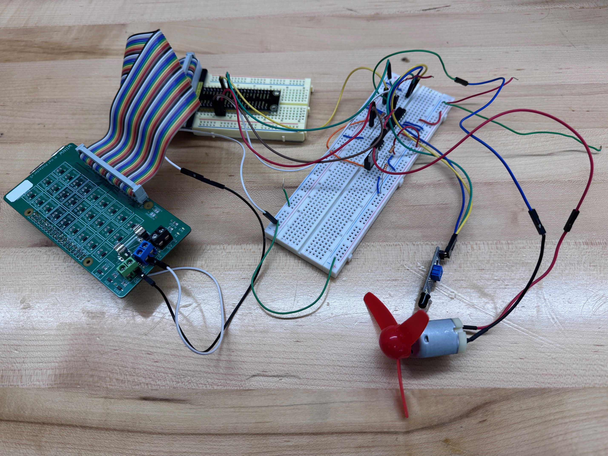
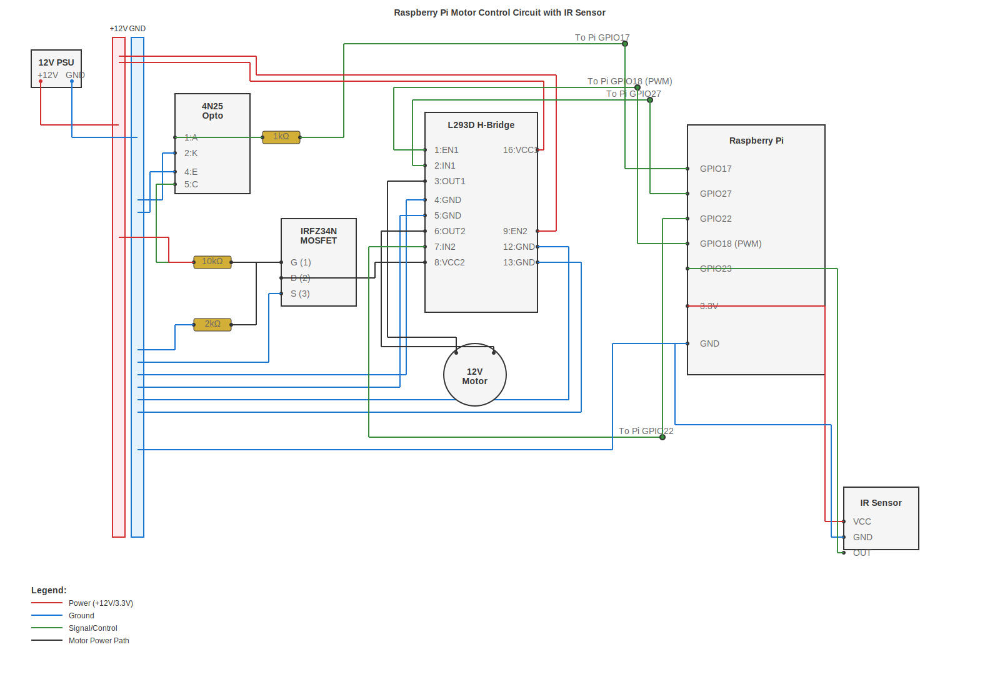
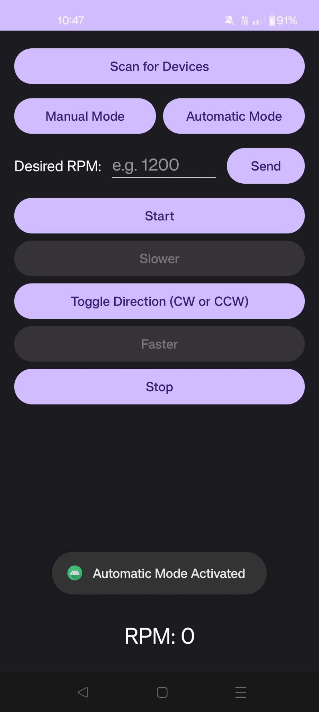

# PARMCO: Phone App RP4 Motor Control
### A Headless, Closed-Loop Embedded System

**Course:** ECSE 4235 - Embedded Systems
**Fall 2025**

---

## 🚀 Project Overview

PARMCO is a full-stack embedded system designed to demonstrate **real-time feedback control** and **headless device management**.

The system consists of a Raspberry Pi 4 that boots into a "headless" appliance mode (no monitor/keyboard required). It hosts a custom Bluetooth server written in C that communicates with a native Android app. The user can control a DC motor in Open-Loop (Manual) mode or switch to Closed-Loop (Automatic) mode, where a PID controller on the Pi maintains a specific RPM using IR sensor feedback.

---

## 🌟 Key Features

* **True Headless Operation:** The system utilizes custom `systemd` services and Python D-Bus agents to handle Bluetooth pairing and security automatically on boot. No GUI interactions are required.
* **PID Feedback Loop:** A Proportional (P-only) controller runs on the Pi, adjusting motor power 4 times a second to maintain target RPM despite load changes.
* **Noise Filtration:** Advanced software filtering (Glitch filters, Physics-based caps, and Smoothing algorithms) allows accurate readings from a noisy low-cost IR sensor.
* **Robust Protocol:** Custom RFCOMM protocol with a State Machine parser handles data fragmentation and ensures connection stability.

---

## 🎮 Usage Guide

Since the system is headless, follow this specific sequence to ensure services load correctly.

### 1. Power Up
* Connect the USB-C power cable to the Raspberry Pi.
* **Wait approximately 30-40 seconds.**
    * *Why?* The boot scripts (`rc.local`) need time to load the Bluetooth stack, clear old security keys (`fix_bluetooth.sh`), and start the "Doorman" agent (`bt_agent.py`).

### 2. Connect the App
* Open the **PARMCO** app on your Android device.
* Tap **"Scan for Devices"**.
* Look for **`group-1`** (or your Pi's specific hostname) in the list.
* Tap to connect.
    * *Note:* The system will automatically handle pairing and service authorization. You should see a "Connected" toast message.

### 3. Manual Control (Open Loop)
* **Start:** Tap **"Start"** to initialize the motor at 30% power.
* **Speed:** Use **"Faster"** and **"Slower"** to adjust the duty cycle by 10%.
* **Direction:** Tap **"Toggle Direction"** to switch between Clockwise and Counter-Clockwise.
* **Stop:** Tap **"Stop"** to cut power immediately.

### 4. Automatic Control (Closed Loop)
* Tap **"Automatic Mode"**.
* Enter a target RPM (e.g., `1000`) in the text box.
* Tap **"Send"**.
* **Observation:**
    * The motor will adjust power to reach the target.
    * **The Finger Test:** If you apply light friction to the propeller, you will hear the motor power increase to fight the resistance and maintain the target RPM. This confirms the PID feedback loop is active.
 
---

## 🛠 System Architecture

### 1. The Hardware (Raspberry Pi 4)

**Circuit Schematic:**

* **Motor Driver:** L293D H-Bridge controlling a 12V DC Motor.
* **Feedback:** IR Obstacle Avoidance Sensor detecting propeller blade passes.
* **Wiring:**
    * **GPIO 18 (PWM):** Speed Control.
    * **GPIO 17/27/22:** Direction and Master Enable.
    * **GPIO 23:** Tachometer Input (Rising Edge Interrupts).

### 2. The Firmware (C & Linux)
The core is a C program (`parmco_server`) running as a high-priority system service.
* **Libraries:** `pigpio` for hardware-timed PWM and interrupts; `bluez` for Bluetooth sockets.
* **Concurrency:** Uses non-blocking sockets to manage the Bluetooth connection without pausing the motor control loop.
* **Safety:** Includes "Anti-Stall" logic to kickstart the motor and "Dead Man's Switch" logic to cut power if the connection is lost.

### 3. The Client (Android/Kotlin)
A native Android application built to interface with the headless unit.
* **Connectivity:** Targets RFCOMM Channel 22 via Reflection to bypass standard UUID caching issues on modern Android/iOS versions.
* **Interface:** Real-time dashboard showing Target vs. Actual RPM.
* **Control:** Toggle switches for Auto/Manual modes and raw input for RPM targets.

  

---

## 🧠 Engineering Challenges & Solutions

### Challenge 1: The "Stale Bond" Problem
**The Issue:** When testing with iOS/Android devices, "forgetting" the device on the phone did not clear the security key on the headless Pi, causing re-connection loops.
**The Solution:** We implemented a boot-time script (`fix_bluetooth.sh`) hooked into `rc.local`. It waits for the Bluetooth stack to stabilize and then surgically removes known MAC addresses from the cache, ensuring the Pi is always "fresh" and ready to pair on reboot.

### Challenge 2: Sensor Noise
**The Issue:** The IR sensor generated microsecond "glitches" and false positives, causing the PID controller to panic and stall the motor.
**The Solution:** We implemented a multi-stage software filter:
1.  **Hardware Filter:** A 100µs glitch filter on the GPIO pin.
2.  **Physics Cap:** Logic to reject RPM readings > 2,500 (physically impossible for this motor).
3.  **Smoothing:** An exponential moving average to stabilize the input for the PID controller.

### Challenge 3: The "Zombie" Process
**The Issue:** The C server would sometimes hang onto the Bluetooth socket after a disconnect, preventing a restart.
**The Solution:** We rewrote the socket handling to be fully non-blocking and added signal handlers (`SIGTERM`, `SIGINT`) to ensure a graceful shutdown and release of hardware resources.

---

## 📂 Source Code Links

* [**C Server Code**](https://github.com/ald13837/ECSE4235_AI_Project/blob/main/Project_Completion/parmco_server.c)
* [**Android App Code**](https://github.com/ald13837/ECSE4235_AI_Project/blob/main/Project_Completion/MainActivity.kt)
* [**Boot Script**](https://github.com/ald13837/ECSE4235_AI_Project/blob/main/Project_Completion/rc.local)

---

**Team Members:** [Aubrey David], [Nevan Mukherjee]
**Instructor:** Dr. Herring
